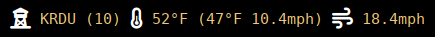

# metar-display

## Synopsis

Retrieve and parse METAR weather for display

## Description

A utility to retrieve METAR weather info, parse it and construct human readable
output.

Sample output when used with polybar, showing station, hour of observation,
temperature, wind chill temperature and wind speed, wind gust speed. And
including Font Awesome glyphs.

## Installation

It's recommended to install a pre-compiled Linux binary either from your
distro's packaging system or from a release on Github but if you like:

    $ cd metar-display
    $ stack build
    $ stack install

Which will install it in `~/.local/bin`

Instructions for use including details regarding integration with polybar's
config are in the usage.

    $ metar-display --help

## Getting source

Source code is available from github at the
[metar-display](https://github.com/dino-/metar-display) project
page.

## Contact

Dino Morelli <dino@ui3.info>
